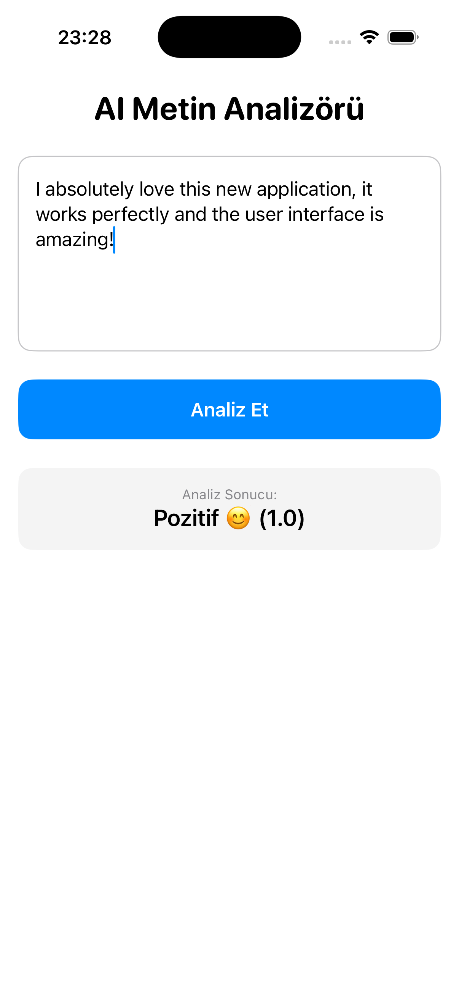
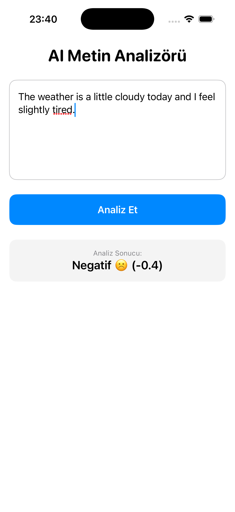

# CoreSense 🧠

**CoreSense**, Apple'ın `Natural Language` framework'ünü kullanarak metinler üzerinde gerçek zamanlı duygu analizi (Sentiment Analysis) yapan bir SwiftUI uygulamasıdır. 

Bu proje, Python dünyasındaki NLP (Natural Language Processing) süreçlerinin Swift ile cihaz üzerinde (on-device) nasıl uygulanabileceğini göstermek amacıyla geliştirilmiştir.

## ✨ Özellikler

* **On-Device Machine Learning:** Veriler sunucuya gönderilmeden, doğrudan cihazın içinde (Neural Engine kullanılarak) işlenir.
* **Sentiment Score:** Metinler -1.0 (Çok Negatif) ile 1.0 (Çok Pozitif) arasında puanlanır.
* **Clean Architecture:** Mantıksal işlemler `MLManager` katmanında, arayüz ise `HomeView` katmanında birbirinden ayrı tutulmuştur.

## 📊 Analiz Örnekleri

Uygulamanın farklı duygu durumlarını nasıl işlediğine dair ekran görüntüleri aşağıdadır:

| Pozitif Analiz | Negatif Analiz |
| :---: | :---: |
|  |  |
| *Yüksek skorlu pozitif bir girdi örneği.* | *Düşük skorlu negatif bir girdi örneği.* |

## 🛠 Teknik Detaylar

Projenin kalbi olan `MLManager.swift` dosyası, Apple'ın `NLTagger` sınıfını kullanır. Duygu analizi yapılırken kullanılan temel mantık şöyledir:

```swift
let tagger = NLTagger(tagSchemes: [.sentimentScore])
tagger.string = inputTextField
let (sentiment, _) = tagger.tag(at: inputTextField.startIndex, unit: .paragraph, scheme: .sentimentScore)
